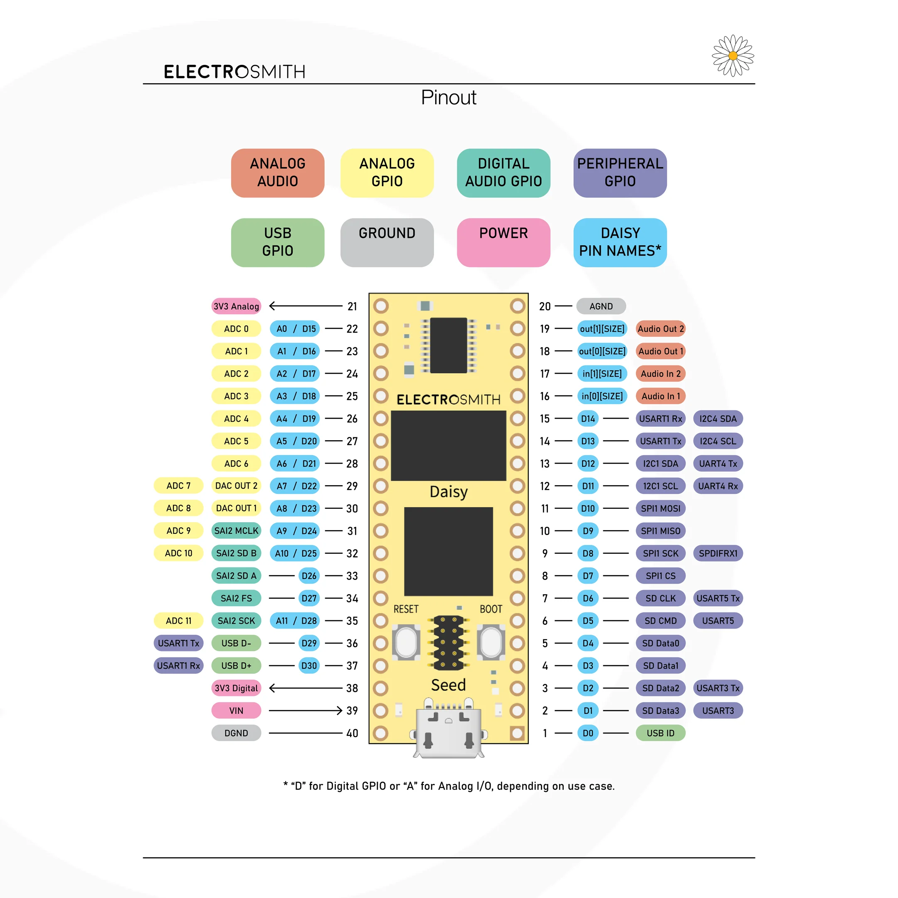

# About

 [Daisy Seed](https://electro-smith.com/products/daisy-seed)
 -  Stereo audio IO - 96kHz / 24-bit audio hardware (AC-Coupled)
 -  x31 GPIO, x12 ADC inputs (16-bit), x2 DAC outputs (12-bit, DC-Coupled)
 -  ARM Cortex-M7 MCU, running at 480MHz
 -  64MB of SDRAM for up to 10 minute long audio buffers, 8MB external flash
 - [Datasheet](https://daisy.nyc3.cdn.digitaloceanspaces.com/products/seed/Daisy_Seed_datasheet_v1-1-5.pdf)
 

### Breadboard Diagram for the demo


### Schematic Diagram for the actual device used in the demo


---
## Setup

### 1. Install Rust and Rustup

First, install Rust using rustup:

[rustup.rs](https://rustup.rs/)

Verify the installation:
```bash
rustc --version
cargo --version
```

### 2. Install ARM Cortex-M Toolchain

The Daisy Seed uses an STM32H750 microcontroller (ARM Cortex-M7), so we need the appropriate target tripple:

```bash
rustup target add thumbv7em-none-eabihf
```

This can be derived from the processors specifications ([Cortex-M7](https://developer.arm.com/Processors/Cortex-M7)) and rust's platform support page ([platform support](https://doc.rust-lang.org/beta/rustc/platform-support.html)). Our processor is the Armv7E-M with hardfloat (on device FPU).

### 3. Install Essential Embedded Development Tools

#### probe-rs
Modern, fast flashing and debugging tool:

See https://probe.rs/docs/getting-started/installation/

#### cargo-binutils
Provides tools for inspecting binaries:

```bash
rustup component add llvm-tools-preview
cargo install cargo-binutils
```
----

## Resources
- If you want to learn more about embedded rust development, check out the following:
  - Rust Learning
    - [No Boilerplate (rust advocate)](https://www.youtube.com/c/NoBoilerplate)
    - [The Rust Programming Language "The Rust Book" (Brown Edu)](https://rust-book.cs.brown.edu/)
  - Embbedded Rust
    - [The Rusty Bits (Youtube)](https://www.youtube.com/@therustybits)
    - [Embedded Rust Book](https://rust-embedded.github.io/book/)
    - [Embassy Book](https://embassy.dev/book/index.html)
    - [RTIC Book](https://rtic.rs/2/book/en/)

_

_

_

_

_

## What this demo will feel like:

